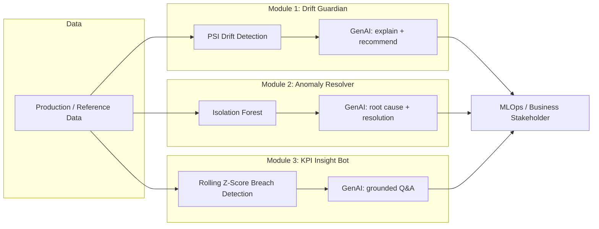

# GenAI-Augmented MLOps & Analytics Copilot

A domain-agnostic reference implementation showing how **GenAI can be layered on top of existing ML pipelines and business dashboards** to close the "so what do I do about it" gap — the part that usually still needs a human analyst.

Three self-contained modules, one shared pattern: **a statistical/ML model detects something → GenAI explains it in plain language and recommends an action.**

| Module | ML/Stats layer | GenAI layer | Answers |
|---|---|---|---|
| **1. Drift Guardian** | Population Stability Index (PSI) per feature | Explains what changed and why, recommends retrain / monitor / investigate | "Is my production model still trustworthy?" |
| **2. Anomaly Resolver** | Isolation Forest (unsupervised) | Root-cause hypothesis + suggested next action + priority | "Why was this flagged, and what do I do about it?" |
| **3. KPI Insight Bot** | Rolling z-score breach detection | Grounded natural-language Q&A over the KPI context | "Why did this metric move, and should I be worried?" |

Built to be **industry-agnostic on purpose** — swap the synthetic data generator for a real feed and the same pipeline applies to telecom (ARPU/churn/network KPIs), retail (basket size/conversion), banking (transactions/fraud), or SaaS (usage/engagement).

## Why this exists

Most "GenAI for analytics" demos stop at a chatbot that answers questions about a CSV. This project instead targets three recurring, high-cost operational pain points:

- **Model drift goes unnoticed** until a business KPI has already dropped — teams find out too late.
- **Anomaly/fraud queues pile up** because flagging is automated but investigation is still 100% manual.
- **Business stakeholders wait on analysts** for a plain-English answer to "why did this number move."

Each module pairs a well-understood statistical/ML technique (so the flagging is grounded and explainable) with a GenAI layer scoped tightly to *explain and recommend* — not to replace the underlying model.

## Architecture



## Project structure

```
genai-mlops-copilot/
├── data/
│   └── synthetic_data_generator.py   # domain-neutral synthetic datasets
├── src/
│   ├── llm_utils.py                  # provider-agnostic GenAI wrapper (mock fallback)
│   ├── drift_guardian.py             # Module 1
│   ├── anomaly_resolver.py           # Module 2
│   └── kpi_insight_bot.py            # Module 3
├── examples/
│   └── run_demo.py                   # end-to-end walkthrough of all 3 modules
├── tests/
│   └── test_modules.py               # pytest sanity tests (no API key required)
├── requirements.txt
└── README.md
```

## Quickstart

```bash
git clone https://github.com/<your-username>/genai-mlops-copilot.git
cd genai-mlops-copilot
pip install -r requirements.txt

# Optional: for real GenAI output instead of mock responses
export ANTHROPIC_API_KEY=sk-ant-...

python examples/run_demo.py
```

No API key? The repo still runs end-to-end — `llm_utils.py` falls back to a clearly-labeled mock response so you can see the full pipeline shape immediately.

Run tests:

```bash
pytest tests/
```

## Sample output (Module 1: Drift Guardian)

```
                      feature  psi_score  flagged
0     feature_support_tickets     1.51       True
1        feature_usage_volume     1.38       True
2  feature_avg_session_length     0.62       True
3         feature_active_days     0.02      False

GenAI explanation:
Support ticket volume and usage patterns have shifted significantly from
the training baseline — consistent with either a recent product change or
an unaddressed incident. Recommendation: retrain the model on the last
30 days of data and flag the support-ticket spike to the ops team for
root-cause review.
```

## Design notes

- **Mock-first, API-optional.** `llm_utils.py` never hard-requires a paid API key — this makes the repo cloneable and runnable by anyone, which matters for a public demo/portfolio project.
- **Grounded, not free-form.** The KPI bot's `ask()` function only lets the model see a structured context pack built from real numbers — this is a lightweight RAG pattern to reduce hallucination risk, appropriate for a business-facing tool.
- **Swappable ML core.** PSI and Isolation Forest are intentionally simple, well-understood baselines. In production you'd likely swap in your existing drift/anomaly detection stack — the GenAI layer is designed to sit on top of whatever structured output that stack already produces.
- **Not production-hardened.** This is a portfolio/reference project: no auth, no persistence layer, no retry/rate-limit handling on the LLM calls. Treat it as an architecture demo, not a deployable service.

## Possible extensions

- Swap the synthetic data generator for a real data connector (warehouse, event stream)
- Add a lightweight Streamlit/Gradio UI for the KPI Insight Bot
- Automate the drift → retrain trigger (currently recommendation-only)
- Add a feedback loop where analyst corrections improve future GenAI resolutions

## License

MIT — see [LICENSE](LICENSE).
